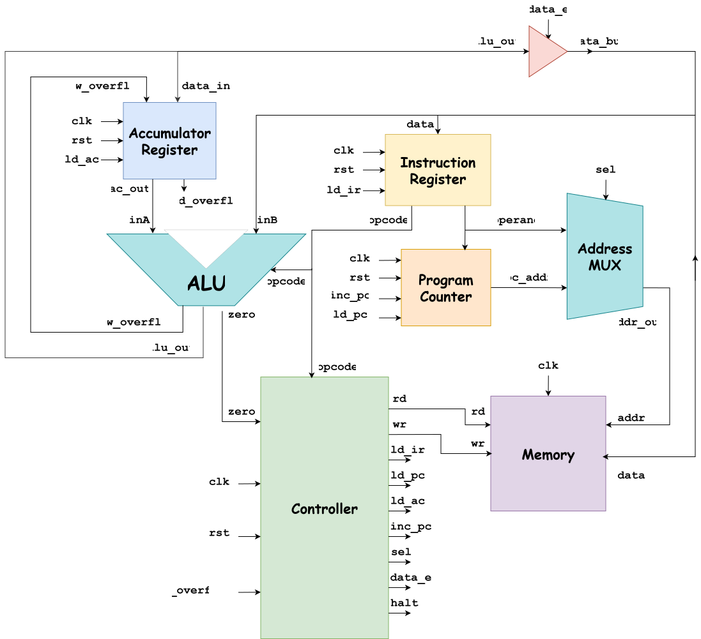

# RISC CPU 16-BIT


## 1. Introduction

**Reduced Instruction Set Computer (RISC)** is a computer architecture designed with a fixed-length set of instructions, which execute in a single clock cycle. In this project, we implement a RISC processor providing 4-bit opcodes (16 instruction types) and 12-bit operand addresses (4096 addresses). It operates on clock and reset signals until triggered by a HALT instruction.

---

## 2. Architecture Overview

### 2.1. Hierarchy Design
The hierarchy design is divided into 7 modules:



### 2.2. Signal Specifications

| Signal Name | Width | Description |
| :--- | :---: | :--- |
| `clk` / `rst` | 1-bit | Global clock and active-HIGH synchronous reset. |
| `halt` | 1-bit | Execution stop signal. |
| `rd` / `wr` | 1-bit | Memory read and write enable control flags. |
| `ld_ir`, `ld_pc`, `ld_ac` | 1-bit | Load enable signals for IR, PC, and AC. |
| `inc_pc` | 1-bit | Program Counter increment control signal. |
| `sel` | 1-bit | Address MUX select line (1: PC address, 0: Operand address). |
| `data_e` | 1-bit | Tri-state buffer enable driving AC data onto `data_bus` during STO. |
| `zero` | 1-bit | Asynchronous ALU zero flag for SKZ. |
| `old_overflow` | 1-bit | Previous overflow. |
| `new_overflow` | 1-bit | Temporary overflow. |
| `ac_out` | 16-bit | Current Accumulator value routed to ALU input A. |
| `alu_out` | 16-bit | Processed ALU output routed to Accumulator input. |
| `opcode` | 4-bit | Operation code controlling ALU function and Controller FSM transitions. |
| `operand` | 12-bit | Target data operand address. |
| `pc_addr` | 12-bit | Current program execution address. |
| `addr` | 12-bit | Target memory addres (`pc_addr`/`operand`). |
| `data_bus` | 16-bit | Bidirectional data bus for memory read/write. |

### 2.3. Opcode Table

| Opcode | Instruction | Description |
| :---: | :---: | :--- |
| `0000` | **HLT** | Halt processor execution |
| `0001` | **SKZ** | Skip next instruction if zero flag is asserted |
| `0010` | **ADD** | Addition operation |
| `0011` | **AND** | Bitwise AND operation |
| `0100` | **XOR** | Bitwise XOR operation |
| `0101` | **LDA** | Load data from memory to Accumulator |
| `0110` | **STO** | Store Accumulator value to Memory |
| `0111` | **JMP** | Jump to target address |
| `1000` | **SUB** | Subtraction operation |
| `1001` | **OR**  | Bitwise OR operation |
| `1010` | **MUL** | Multiplication operation |
| `1011` | **MAC** | Multiply-Accumulate operation |
| `1100` | **SHL** | Shift left operation |
| `1101` | **SHR** | Shift right operation |
| `1110` | **NOT** | Invert the Accumulator value |
| `1111` | **SKO** | Skip next instruction if overflow |

### 2.4. System Workflow

The processor executes each instruction through an 8-state FSM sequence managed by the Controller over 8 consecutive clock cycles:

1. **`INST_ADDR` (Instruction Address):** Controller sets `sel = 1`, routing `pc_addr` through the Address MUX to Memory's address.

2. **`INST_FETCH` (Instruction Fetch):** Controller asserts `rd = 1` to read instruction data from Memory onto `data_bus`.
3. **`INST_LOAD` (Instruction Load):** Controller asserts `ld_ir = 1` to latch instruction data into the Instruction Register (IR).
4. **`IDLE` (Decode & Stabilize):** IR exposes `opcode` to Controller/ALU and `operand` address to Address MUX.
5. **`OP_ADDR` (Operand Address):** Controller sets `sel = 0` to route operand address to Memory, while asserting `inc_pc = 1` to advance PC.
6. **`OP_FETCH` (Operand Fetch):** Controller asserts `rd = 1` for memory-referencing instructions to fetch data onto `data_bus` (ALU input `inB`).
7. **`ALU_OP` (ALU Operation):** ALU processes `inA` (Accumulator) and `inB` (Memory):
   - **`SKZ` / `SKO`:** Asserts `inc_pc = 1` if skip condition is satisfied.
   - **`JMP`:** Asserts `ld_pc = 1` to load target jump address into PC.
   - **`STO`:** Asserts `data_e = 1` to drive Accumulator data onto `data_bus`.
8. **`STORE` (Writeback):** Controller asserts `ld_ac = 1` to update Accumulator, or `wr = 1` during `STO` to write back to Memory.

Upon completing **`STORE`**, execution cycles back to **`INST_ADDR`** unless a `HLT` instruction halts the processor.

---

The table below details the control signal outputs generated by the Controller FSM across the 8 execution phases:

| Control Signal | INST_ADDR | INST_FETCH | INST_LOAD | IDLE | OP_ADDR | OP_FETCH | ALU_OP | STORE | Description |
| :--- | :---: | :---: | :---: | :---: | :---: | :---: | :---: | :---: | :--- |
| `sel` | 1 | 1 | 1 | 1 | 0 | 0 | 0 | 0 | **1**: Selects **PC** address (`pc_addr`), **0**: Selects operand address (`operand`). |
| `rd` | 0 | 1 | 1 | 1 | 0 | ALUOP | ALUOP | ALUOP | Asserts `1` to read memory during instruction fetch or operand fetch. |
| `ld_ir` | 0 | 0 | 1 | 1 | 0 | 0 | 0 | 0 | Latches fetched instruction from `data_bus` into **IR**. |
| `halt` | 0 | 0 | 0 | 0 | HALT | 0 | 0 | 0 | Asserts `1` to halt processor execution upon decoding `HLT` (`0000`). |
| `inc_pc` | 0 | 0 | 0 | 0 | 1 | 0 | SKIP | 0 | Increments **PC** by 1 at `OP_ADDR`; asserts again at `ALU_OP` if skip condition is met. |
| `ld_ac` | 0 | 0 | 0 | 0 | 0 | 0 | 0 | ALUOP | Latches **ALU** result into **AC** during `STORE` phase. |
| `ld_pc` | 0 | 0 | 0 | 0 | 0 | 0 | JMP | JMP | Loads target jump address into **PC** upon decoding `JMP` (`0111`). |
| `wr` | 0 | 0 | 0 | 0 | 0 | 0 | 0 | STO | Asserts `1` during `STORE` phase to write **AC** data into Memory. |
| `data_e` | 0 | 0 | 0 | 0 | 0 | 0 | STO | STO | Enables tri-state buffer to drive **AC** data onto `data_bus` for `STO`. |

---

#### Control Definitions

* **`ALUOP`**: Asserts `1` for instructions performing arithmetic/logic operations or requiring Accumulator updates (`ADD`, `SUB`, `AND`, `OR`, `XOR`, `MUL`, `FPU_MUL`, `LDA`, `SHL`, `SHR`, `NOT`).
* **`HALT`**: Asserts `1` when Opcode = `0000` (`HLT`).
* **`JMP`**: Asserts `1` when Opcode = `0111` (`JMP`).
* **`STO`**: Asserts `1` when Opcode = `0110` (`STO`).
* **`SKIP`**: Asserts `1` when branch conditions are evaluated as true:
  * Opcode = `0001` (`SKZ`) **AND** `zero == 1`
  * Opcode = `1111` (`SKO`) **AND** `overflow == 1`

---

## 3. Code Tree

```text
risc-cpu-16-bit/
├── RTL/
│   ├── cpu.v
│   ├── accumulator.v                    
│   ├── address_mux.v
│   ├── alu.v
│   ├── controller.v
│   ├── instruction_register.v
│   ├── memory.v
│   └── program_counter.v
├── Testbench/     
│   ├── cpu_testcases.v                        
│   ├── accumulator_tb.v                    
│   ├── address_mux_tb.v
│   ├── alu_tb.v
│   ├── controller_tb.v
│   ├── instruction_register_tb.v
│   ├── memory_tb.v
│   ├── program_counter_tb.v
│   ├── test_scenarios.txt
│   ├── test1.txt
│   ├── test2.txt
│   ├── test3.txt
│   ├── test4.txt
│   └── test5.txt
├── Figure/
│   └── hierarchy.png
├── Waveform/
│   ├── Test1_waveform.png
│   ├── Test2_waveform.png
│   ├── Test3_waveform.png
│   ├── Test4_waveform.png
│   └── Test5_waveform.png
├── .gitignore                  
└── README.md
```

---

## 4. Verification Workflow

### The testbench’s key elements include:

* **System Clock (*always #5 clk = ~clk;*)**: Establishes a clock of 100 MHz clock.

* **The ***test_case*** Index**: A tracking variable used to identify suitable display
mode to the TCL console.

* **Memory Clear Task (*clear_ram*)**: A task used for zeroing out all memory addresses (***uut.mem.ram[i] = 16’b0***) before loading a new test.

* **Data Setup Task (*setup*)**: A task used for initializing program instructions and
data from an input ***text file*** of each testcase.

* **TCL Console Monitoring**: When
***test_case == 1***, the console logs signal changes. For
other tests (***test_case != 1***), the TCL console prints out time, current test case, controller state, opcode, accumulator value, and the halt flag.

### The testbench behaves according to the following cycle:

```text
+---------------------------------------------------+
|             Clear Memory via clear_ram            |
+---------------------------------------------------+
                        |
                        v
+---------------------------------------------------+
|   Setup program instructions and data via setup   |
+---------------------------------------------------+
                        |
                        v
+---------------------------------------------------+
|   Reset the system by pulsing rst High -> Low     |
+---------------------------------------------------+
                        |
                        v
+---------------------------------------------------+
|        Start execution until halt === 1'b1        |
+---------------------------------------------------+
                        |
                        v
+---------------------------------------------------+
|        Validate outputs against predictions       |
+---------------------------------------------------+
```

### Table of Testcases

| Test ID | Test Case Name | Scope | Tested Instructions | Objective & Criteria | Result |
| :---: | :--- | :--- | :--- | :--- | :---: |
| **TC_01** | **Signal Verification** | Controller FSM & Synchronization | `LDA`, `HALT` | Correct 8-state sequence and control signal timing | **PASSED** |
| **TC_02** | **ALU Operations** | ALU Logic & AC Register | `LDA`, `ADD`, `AND`, `XOR`, `SUB`, `MUL`, `MAC` | Accurate calculation and writeback | **PASSED** |
| **TC_03** | **Special Logic Operations** | Branching, Flags & Memory Write | `JMP`, `SKZ`, `SKO`, `STO`, `SHL`, `SHR`, `OR` | Correct target jump, skip, and Memory store | **PASSED** |
| **TC_04** | **Basic Combinational Test** | Data Pipeline & Bus Stability | `LDA`, `ADD`, `STO`, `HALT` | Stable bus transfer during execution | **PASSED** |
| **TC_05** | **Complex Combinational Test** | Dynamic Workload & Edge Cases | Full 16 Instructions | Timing hazards under dynamic workload | **PASSED** |

---

## 5. Synthesis Results

* Target board: Arty Z7-20
* Stage: Post-Implementation

| Performance Criteria | Synthesized Value |
| :---: | :---: |
| LUT | 168 |
| FF | 101 |
| BRAM | 2 |
| DSP | 2 |
| IO | 3 Pins |
| Worst Negative Slack (WNS) | 0.095 ns |
| Total Power | 0.118 W |
| Junction Temperature | 26.4 °C |

---

## 6. Demo instruction

This project includes unit testbenches for individual RTL modules and a top-level CPU testbench running all program testcases (`cpu_testcases.v`). Test results are automatically verified via terminal and signals can be tracked from waveform.

### Prerequisites

* **AMD/Xilinx Vivado**
* **Git**
---

### Step 1: Clone the Repository

Open your terminal or command prompt and clone the repository:

```bash
git clone [https://github.com/pmhuy2302/risc-cpu-16-bit.git](https://github.com/pmhuy2302/risc-cpu-16-bit.git)
cd risc-cpu-16-bit
```

---

### Step 2: Set Up the Vivado Project

1. Launch **Vivado**.
2. Click **Create Project** -> Name your project and click **Next**.
3. Select **RTL Project** (leave *Do not specify sources at this time* unchecked).
4. **Add Source Files:**
   * Click **Add Files** and select all `.v` files inside the `RTL/` directory (`accumulator.v`, `address_mux.v`, `alu.v`, `controller.v`, `cpu.v`, `instruction_register.v`, `memory.v`, `program_counter.v`).
   * Set `cpu.v` as the Top Module.
5. Select your target FPGA board/part and click **Finish**.
6. **Add Simulation Sources:** In the Vivado **Sources** panel, expand **Simulation Sources** -> Right-click the `sim_1` -> **Add Sources...**.
   * Click **Add Files** and select all `.v` and `.txt` files inside the `Testbench/` directory.

---

### Step 3: Run Unit Tests (Module-Level)

To test individual modules:

1. In the Vivado **Sources** panel, expand **Simulation Sources** -> `sim_1`.
2. Right-click the desired module testbench (e.g., `alu_tb.v`) and select **Set as Top**.
3. In the left Flow Navigator, click **Run Simulation** -> **Run Behavioral Simulation**.
4. Check the **Tcl Console**:
   * Inspect the `if/else` print statements verifying module outputs against expected values.
5. Inspect the **Waveform Window** to verify signal timings, state transitions, and flag assertions.

---

### Step 4: Run CPU Tests (Top-Level)

To verify complete execution across the entire pipeline:

1. In **Simulation Sources**, right-click `cpu_testcases.v` and select **Set as Top**.
2. Click **Run Simulation** -> **Run Behavioral Simulation**.
3. Observe the **Tcl Console Output**:
   * The testbench will execute scripts from the `.txt` files.
   * Review the terminal output logs for pass/fail status.
4. **Inspect CPU Waveforms:**
   * Key signals to add to the Waveform viewer: `clk`, `rst`, `halt`, `opcode`, `operand`, `alu_out`, `ac_out`.